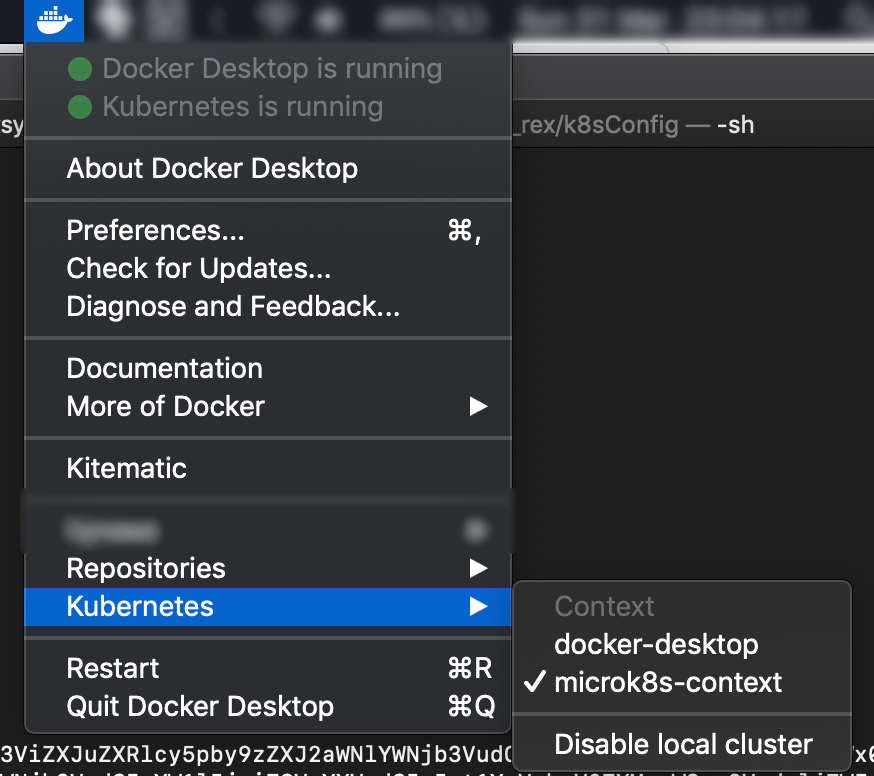
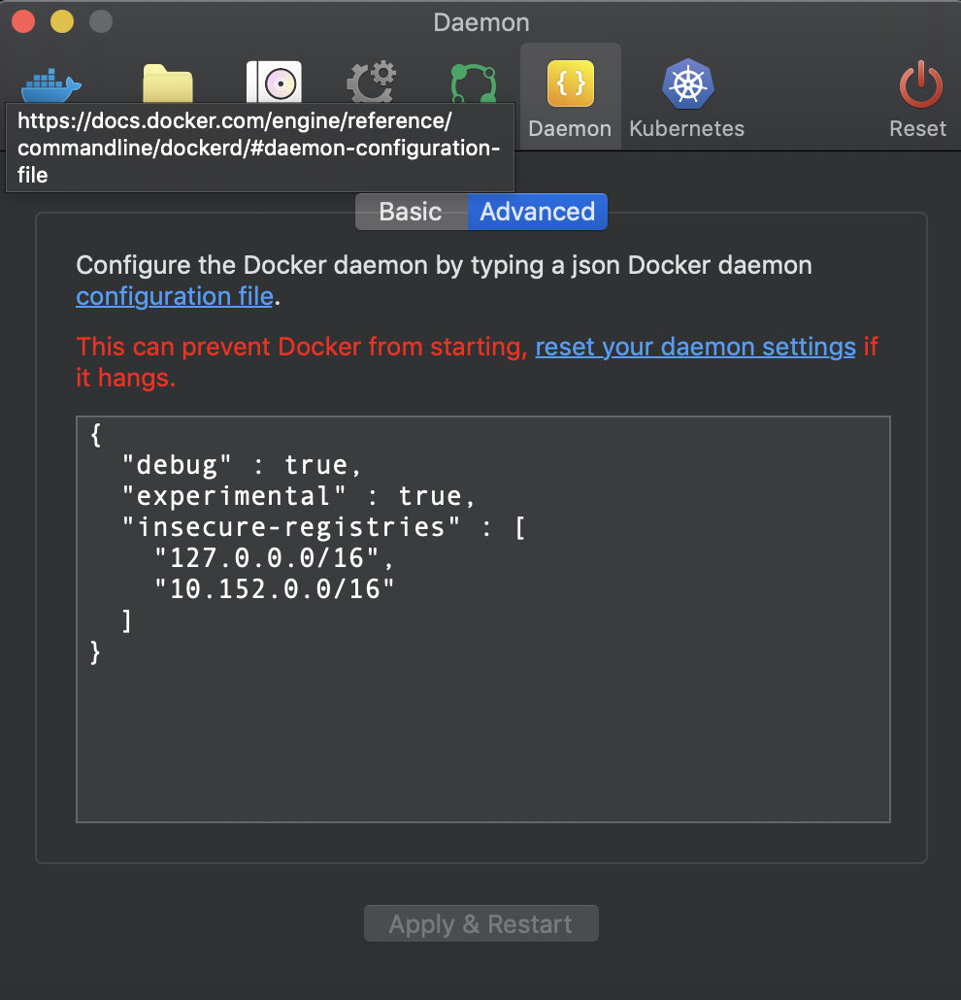

# k8sConfig
A microk8s config for non production app deployments

## microk8s in the cloud: a low cost, cloud-agnostic Kubernetes cluster
Kubernetes is a hugely powerful open source container orchestration engine for automating deployment, scaling, and management of containerized applications. By developing applications for Kubernetes, applications are easy to deploy, scale and monitor. Organisations can reduce many of the risks and costs associated with building, maintaining and supporting their applications.

All major cloud providers support Kubernetes, including Google (GKE), Amazon Web Services (AKS) and Microsoft Azure (TODO). However, you'll quickly find that once you start deploying a couple of applications, and with each application being available in multiple environments; costs can add up very quickly.

This technical article gives instructions on how to run microk8s Kubernets in the cloud so you can spin up applications without the cost overhead. I'll show you how to quickly and reliably set up microk8s. This article is quite lengthy and in-depth and is designed for my company's requirements, but you can pick and choose from:

* Installation on Ubuntu 18.04
* DNS set up
* Firewall configuration (Kubernetes cluster is secure - only http and https accessible)
* SSL using letsencrypt
* Multiple domain names from the same Kubernetes cluster
* Kubernetes ingress
* Authentication of specific routes
* Running a private Docker registry on microk8s Kubernetes
* Connecting Docker for Mac to microk8s Kubernetes cluster

### Desired result
A microk8s Kubernetes that serves all my non-production web apps. All apps served over https. I can configure any of my domain names to run on my microk8s cluster. I can send my client a password to the public URL so they can login and see the most up-to-date version of their product. My microk8s Kubernetes cluster also runs my Jenkins server. And I can use Docker for Mac to seamlessly deploy containers from my local machine to my microk8s Kubernetes cluster.

My goal is to increase my operational efficiency, increase my product deployment velocity, increase product quality and lower costs.

### So, what problem are we solving?
Managed Kubernetes in the cloud can be expensive. Configuring your own microk8s Kubernetes on your own VM can be much cheaper (about 10 times cheaper in my case).

If you're an indy developer or small software dev team (like me!), things can get relatively expensive. Costs can add up for a Kubernetes application with three environments (PRODUCTION, UAT and DEV). Pricing structures vary considerably across the major cloud providers but in my case, the cost of running an AWS Kubernetes cluster could easily run over $1000 a month. Check with your cloud provider for most up-to-date pricing information:

* [Microsoft Azure AKS](https://azure.microsoft.com/en-gb/services/kubernetes-service/)
* [Amazon Web Services EKS](https://aws.amazon.com/eks/)
* [Google Cloud GKE](https://cloud.google.com/kubernetes-engine/)

A good cost comparison overview article: https://www.replex.io/blog/the-ultimate-kubernetes-cost-guide-aws-vs-gce-vs-azure-vs-digital-ocean

The cost of running your application on a managed Kubernetes cloud can get quite expensive, depending on what you're doing, of course. For example, managed services are incredibly cheap when you consider the cost of setting up and maintaining your own mission-critical, enterprise-grade infrastructure (arguably, it would be hard to beat Amazon or Microsoft on service quality and cost when an enterprise-grade cluster is required).

But do you really need a fully managed, enterprise-grade Kubernetes cloud service for your non production apps? Sometimes even your production app may not need the 99.99% up-time provided by managed Kubernetes infrastructure. Perhaps 99% is OK for your needs? Is the expense always justified? What if you have several clients and dozens of projects? Costs can add up very quickly.

I build software applications for a living and the DevOps pipeline I use for every product I build is deployed in multiple environments. Each product I'm working on is live in multiple environments. This is a common workflow and used extensively. I typically have three or four environments, depending on my clients' needs - **DEV** (development environment), **UAT** (user account testing) and **PRODUCTION** (production). My CI/CD pipeline (Jenkins) typically consists of:

* build application
* test application
* unit test application
* save build artefact
* deploy application on Kubernetes

You can save a lot of money by deploying to cheaper Kubernetes infrastructure.

### How I arrived at Kubernetes

It's been quite a journey. Back in the day, I had an account on a Sun Microsystems machine at my university. I could serve a web page to anyone in the world from my /~hynese public folder. Some of us may remember the days of writing your web page in HTML, CSS and JavaScript and using FTP to sync your local folder with your remote folder. There's so much wrong with this approach but that's also for another article.

I soon learned (the hard way) that syncing folders is not the way to do things. And that writing inline PHP (yuck!) in your HTML (very quickly) leads to problems. Even when working solo and not as part of a team.
I learned MVC (model, view, controller) architecture which improved things. I started using Iaas (infrastructure-as-a-service) on AWS which made life much easier. I started using github which made life much easier. I started to automatically deploy things which made life much easier. I started to use proper CI/CD tools like Jenkins and multiple environments - which improved things. I started building apps for PaaS (platform-as-a-service) on AWS and IBM which improved things. I learnt Agile methodology and started using Pivotal Tracker. And doing proper business analysis. I started to learn about containers and CaaS (container-as-a-service) cloud infrastructure. I became a faster, more effective, more efficient developer with strong ops know-how. But I was beginning to worry (just a tad) - the software I'm building only seemed to run on AWS and it seemed that every month, costs were incrementing. In the good old days I could write my web page and deploy it on a Sun server or any other server I had an account on. I was beginning to feel locked in to my cloud provider. I was beginning to feel a bit uncomfortable. Less free.

Until I discovered Kubernetes. Kubernetes allows me to avoid much of the vendor lock-in risks while enabling me to build and deploy scalable container applications with ease. I get to leverage modern software development techniques but in a cloud agnostic way. It's amazing to have all these tools at my fingertips and I'm hugely grateful for all the open source contributions.

### microk8s for non-production deployments
My solution to keeping costs down while maintaining all the benefits of Kubernetes infrastructure is to use microk8s. microk8s is an easy-to-install Kubernetes engine for Ubuntu. It's important to note that mickrok8s **does not scale!!!*** But that's not the point here. microk8s is designed as a developer tool to allow you to quickly and reliably test your applications with low configuration overhead. In my case, I don't just use microk8s for testing, I use microk8s to deploy all my non-production applications.

Some advantages of microk8s:
* Reduce cloud vender lock-in. microk8s runs on any up-to-date Ubuntu box
* Lower cost (depending on business objectives)
* Mature, easy to install, well supported

Some disadvantages of microk8s:
* Does not scale
* Some Kubernetes features not supported (e.g. load balancing)
non production deployment configuration may be slightly different to production deployment configuration (developers should aim for no difference or minimal difference)
* Must manage the microk8s installation (patching, disk space, security, etc.)
* Not enterprise grade

In my situation (several clients, dozens of applications, limited budget); the advantages of using microk8s for non-production deployments considerably outweigh any disadvantages.
This article is divided into two parts:

**Part 1**: Setting up a microk8s box from scratch. Complete and detailed instructions on how to set up microk8s in the cloud (Amazon EC2).

**Part 2**: Configuring microk8s to serve the specific needs of my company: a low cost infrastructure to deploy non-production applications to.

## Part 1: Setting up a microk8s box from scratch

Installing microk8s on Amazon EC2 (infrastrcture-as-a-service) is easy. Simply spin up an Ubuntu 18.04 instance. We'll be running several containers so recommend at least a t3.small (or whatever the equivalent is on Google or Azure). Note on storage: recommend at least 32GB of storage. It's very difficult to add additional storage without stopping the machine, expanding the partition and restarting. I tried (and failed) to use external storage for storing snap data. Finally, I recommend using an Elastic IP address so your IP doesn't change every time your EC2 instance reboots.

First, update your system:

```
sudo apt-get update
sudo apt-get dist-upgrade
sudo apt-get autoremove
```

Now install microk8s:

`sudo snap install microk8s - classic`

Add microk8s.kubctl to your path

```
echo "source <(microk8s.kubectl completion bash)" >> ~/.bashrc
source ~/.bashrc
```

Confirm microk8s is running with:

`microk8s.kubectl cluster-info`

Get more detail on current state with:

`microk8s.kubectl get all - all-namespaces`

Before we do anything further, there are some firewall additions we need to make (double-check settings and do your own research). Also as we're running microk8s on a public IP address, we need to constrain public access to only those ports that are needed (port 22, 80 and 443).

```
# Enable port forwarding on all interfaces:
sudo iptables -P FORWARD ACCEPT
# Make this permanent across reboots:
sudo vim /etc/sysctl.conf
# Append this line to the end of the file:
net.ipv4.ip_forward=1
# and enable with:
sudo sysctl -p
# Also need to tweak the cbr0 bridge interface ufw rules slightly:
sudo ufw allow in on cbr0 && sudo ufw allow out on cbr0
# Allow routing:
sudo ufw default allow routed
# Allow ssh, http and https:
sudo ufw allow 22
sudo ufw allow 80
sudo ufw allow 443
# And enable the firewall:
sudo ufw enable
# Finally, restart Kubernetes:
sudo microk8s.stop
sudo microk8s.start
```

Now if we do:

`microk8s.kubectl get all - all-namespaces`

Everything should look in order.

### Install kubernetes addons

For the setup in the article, we'll be utilising additional addons:

```
microk8s.enable dns dashboard ingress registry storage
```

* **dns** - resolve service names to IP addresses
* **dashboard** - get an intuitive web UI into our "cluster"
* **ingress** - be able to split http traffic to different containers * according to our needs
* **registry** - store build images in our own private registry
* **storage** - we want to provide persistent storage capabilities to our deployments

### Accessing Kubernetes ports on a local developer machine

OK, so we have microk8s installed on an Amazon EC2 instance. We have its IP address. But I can't access any of the ports except for ports 22, 80  and 443. I need to be able to interact with the Kubernetes API service and it operates on IP addresses that aren't accessible and on ports other than 22, 80 and 443.

The trick now is to use a [sshuttle](https://github.com/sshuttle/sshuttle) to set up a tunnel (secure over ssh) to our EC2 instance and route any requests matching the 10.152.0.0/8 netmask (the netmask for microk8s) through our Amazon EC2 instance rather than the developer's local machine.

If you're developing on a Mac, install shuttle with:

`brew install shuttle`

To set up a tunnel to your EC2 instance, simply do:

`sshuttle -r -i ~/Desktop/mykey.pem ubuntu@$REMOTE_EC2 10.152.0.0/8`

, where $REMOTE_EC2 is your instance's public IP address and mykey.pem is your Amazon private ssh key.

### Check everything is working

To check everything is working OK, let's deploy a simple nginx deployment:
```
microk8s.kubectl create deployment nginx --image=nginx
# You should now be able to see your nginx by running:
microk8s.kubectl get all --all-namespaces
# But nginx needs a service so we can attach to it:
microk8s.kubectl create service clusterip nginx --tcp=80:80
```

Note: we're using a "clusterip" type service. There are 4 types of service available to you:

* clusterip (an IP address is given to your pod
* nodeport (a port on your pod is accessible via a port on your Kubernetes cluster IP)
* loadbalancer (traffic is load balanced across your pods)
* externalname (maps external CNAME to a pod)

Note: **loadbalancer is not available on microk8s**.

It's worth researching details on each type of service. In a production system (i.e. not microk8s), I'd expect loadbalancer to be used and not clusterip. Very often this is the only difference between your production and non-production Kubernetes deployments. It's also worth noting that the loadbalancer service differs across cloud providers - Amazon implements load balancing different to the way Microsoft and Google do. Load balancer pricing also varies a lot between cloud providers.

Now that nginx is running and we've exposed a clusterip service, let's get the ip address:

`microk8s.kubectl get all --all-namespaces`

Once we get the ip address, simply type it into a web browser on your development maching (in my case Brave browser on a Mac):

http://10.152.183.236/

If you see "Welcome to nginx!", congratulations; you've just successfully served a web page from your a microk8s cluster.

### DNS setup

It's useful to be able to lookup our nginx using its name. For example:

```
nslookup nginx.default.svc.cluster.local
```

should return an IP address, but it doesn't.

```
# Let's add an additional nameserver using resolvconf.
sudo apt-get install resolvconf
sudo vim /etc/resolvconf/resolv.conf.d/tail
# Add the following line:
nameserver 10.152.183.10
# , where 10.152.183.10 is your Kubernetes DNS IP address (get this from `microk8s.kubectl get all - all-namespaces`).
# reboot your machine:
sudo reboot
```

On reboot, should now be able to do:

```
nslookup nginx.default.svc.cluster.local
```

## Part 2: Using microk8s for all your non-production applications

Now that you have microk8s set up, it's time to configure it to handle multiple projects, with each project having several environments. There are several other things we need to configure.

I'll show how to configure a Kubernetes ingress featuring the following:
* https using letsencrypt
* multiple domain names and sub-domain names. Support for multiple environments - production and non-production
* basic authorization of all non-production endpoints

### Set up DNS and handle multiple domain names

Before we can do anything, we must set up DNS entries. The purpose of this article is not to explain DNS and I'll assume familiarity with DNS records. I personally use my own DNS server (I highly recommend mailinabox) and am free from vendor-specific services such as Route53 (Amazon Web Services). For production applications, I recommend using an enterprise-grade DNS service such as Route53.

For the purposes of this article, let's assume we have two domain names we want our microk8s Kubernetes non-elastic cluster to handle:

* rexsystems.co.uk (two environments - DEV and PRODUCTION)
* ideahopper.org (three environments - DEV, UAT and PRODUCTION)

rexsystems.co.uk is my own domain and is a very simple website. If it looks good in DEV, I'm happy to put it in production.

ideahopper.org is for a client and I have three environments set up there. Periodically we promote a DEV build to UAT. We send the UAT link to the client for review. If the client is happy with UAT, we can promote to PRODUCTION.

Finally, for the purposes of this tutorial, microk8s will be serving both non-production environments and production environments. Ordinarily, we'd have a separate IP (or load balancer) for non-production apps (our microk8s "cluster") and production apps (a managed Kubernetes service).

Here are the required DNS records:

* **A record**: rexsystems.co.uk - 99.80.128.68
* **A record**: ideahopper.org - 99.80.128.68
* **A record**: dev.web.0001.rexsystems.co.uk - 99.80.128.68
* **A record**: dev.api.0001.rexsystems.co.uk - 99.80.128.68
* **A record**: dev.web.0002.rexsystems.co.uk - 99.80.128.68
* **A record**: dev.api.0002.rexsystems.co.uk - 99.80.128.68
* **A record**: uat.web.0002.rexsystems.co.uk - 99.80.128.68
* **A record**: uat.api.0002.rexsystems.co.uk - 99.80.128.68
* **A record**: staging.web.0002.rexsystems.co.uk - 99.80.128.68
* **A record**: staging.api.0002.rexsystems.co.uk - 99.80.128.68

When using production infrastructure, simply update the DNS records.

### Setting up the ingress

For this article, the ingress will support two domains:

* rexsystems.co.uk
* ideahopper.org

rexsystems.co.uk has two environments (DEV and PRODUCTION). ideahopper.org has three environments (DEV, UAT and PRODUCTION). So, we need the ingress to support the following routes (https is not enabled just yet):

* http://rexsystems.co.uk
* http://ideahopper.org
* http://dev.web.0001.rexsystems.co.uk (authorization required)
* http://dev.api.0001.rexsystems.co.uk (authorization required)
* http://dev.web.0002.rexsystems.co.uk (authorization required)
* http://dev.api.0002.rexsystems.co.uk (authorization required)
* etc.

We want authorization on all nonprod environments and no authorization on all prod environments. Because of this split, we'll create two separate ingresses:
* ingress-noauth.yaml
* ingress-auth.yaml

Because my authentication and authorization requirements are very simple (at the moment), I'll be using Basic Authentication which is supported by Kubernetes.

Here is an ingress for PRODUCTION endpoints (i.e. no authorization) called "ingress-noauth.yaml":

```
apiVersion: extensions/v1beta1
kind: Ingress
metadata:
name: ingress-fanout-noauth
annotations:
# remove www prefix
nginx.ingress.kubernetes.io/rewrite-target: /
nginx.ingress.kubernetes.io/configuration-snippet: |
  if ( $host ~ ^www\.(.+)$ ) {
    set $without_www $1;
    rewrite ^ $scheme://$without_www$uri 302;
  }
spec:
  rules:
  - host: rexsystems.co.uk
    http:
      paths:
      - path: /
        backend:
          serviceName: rexsystems-web-production
          servicePort: 80
      - path: /api
        backend:
          serviceName: rexsystems-api-production
          servicePort: 80

  - host: www.rexsystems.co.uk
    http:
      paths:
      - path: /
        backend:
          serviceName: rexsystems-web-production
          servicePort: 80
      - path: /api
        backend:
          serviceName: rexsystems-api-production
          servicePort: 80

  - host: ideahopper.org
    http:
      paths:
      - path: /
        backend:
          serviceName: ideahopper-web-production
          servicePort: 80
      - path: /api
        backend:
          serviceName: ideahopper-api-production
          servicePort: 80
#  tls:
#  - secretName: tls-secret-rexsystems-co-uk
#  - secretName: tls-secret-www-rexsystems-co-uk
#  - secretName: tls-secret-ideahopper-org
```

Note: the last four lines are commented out. This is the SSL/https configuration - we'll get to this in the next section...

It won't work if you try to create the ingress with:

```
microk8s.kubectl create -f ingress-noauth.yaml
```

You first need to start two containers (rex-prod and ideahopper-prod); with each container having its own service to expose the container to the cluster.

Let's spin up some bog standard nginx containers:
```
microk8s.kubectl create deployment rexsystems-web-production --image=nginx
microk8s.kubectl create deployment rexsystems-api-production --image=nginx
microk8s.kubectl create deployment ideahopper-web-production --image=nginx
microk8s.kubectl create deployment ideahopper-api-production --image=nginx
```

So we can identify which one is which, let's login to each pod and change the default webpage text:

```
# Get the pod names:
microk8s.kubectl get pod
#Login to rex-prod:
microk8s.kubectl exec -it rex-prod______ -- /bin/bash
#Mark the default index.html page:
echo "rex-PRODUCTION" >> /usr/share/nginx/html/index.html
#logout
#Do the same for ideahopper-prod
microk8s.kubectl exec -it ideahopper-prod______ -- /bin/bash
#Mark the default index.html page:
echo "ideahopper-PRODUCTION" >> /usr/share/nginx/html/index.html
#logout
```

Our ingress doesn't connect to pods or deployments. The ingress serves services. We need to create a service for each of our two deployments (rex-prod and ideahopper-prod):

```
microk8s.kubectl create service clusterip rexsystems-web-production --tcp=80:80
microk8s.kubectl create service clusterip rexsystems-api-production --tcp=80:80
microk8s.kubectl create service clusterip ideahopper-web-production --tcp=80:80
microk8s.kubectl create service clusterip ideahopper-api-production --tcp=80:80

# View the cluster IP addresses with:
microk8s.kubectl get service
```

Now you should be able to start the ingress:

```
microk8s.kubectl create -f ingress-noauth.yaml
```

Navigate to your domains (http://rexsystems.co.uk and http://ideahopper.org) and you should see the default nginx page showing your service name.

Voila!

### Authorization

We don't want to allow public access to non-production environments. So placing a username and password on all non-production endpoints makes sense. I use Basic http Authorization in this setup. There are more advanced authorization and authentication mechanisms available, but these are overkill for my needs. **Note: I highly recommend not using Basic Authorization without SSL/https enabled. Using Basic Authorization over http transmits your username/password pair in the clear. Make sure you know what you are doing**.

***
Note: I previously attempted to set up my ingres to allow routing such as:
- http://nonprod.rexapp.rexsystems.co.uk/web/api
- http://nonprod.ideahopper.rexsystems.co.uk/web/api
- etc.

Three issues here:
1. Routing (e.g. API traffic routing) should be done in Kubernetes (not web app). Avail of high performance load balancers, etc.
2. DNS leaking. Use code names instead of your product's full domain name.
3. React/front-end configuration. Preferable to KISS
***

Here is a Kubernetes ingress with basic authorization:

```
apiVersion: extensions/v1beta1
kind: Ingress
metadata:
  name: ingress-fanout-auth
  annotations:
    # basic auth:
    nginx.ingress.kubernetes.io/auth-type: basic
    nginx.ingress.kubernetes.io/auth-secret: htsecret
    nginx.ingress.kubernetes.io/auth-realm: "Authentication Required"

    nginx.ingress.kubernetes.io/rewrite-target: /
spec:
  rules:

  #rexapp (0001)
  - host: dev.web.0001.rexsystems.co.uk
    http:
      paths:
      - path: /
        backend:
          serviceName: rexapp-web-dev
          servicePort: 80
      - path: /api
        backend:
          serviceName: rexapp-api-dev
          servicePort: 80
  - host: dev.api.0001.rexsystems.co.uk
      - path: /
        backend:
          serviceName: rexapp-api-dev
          servicePort: 80

  #ideahopper (0002)
  - host: dev.web.0002.rexsystems.co.uk
    http:
      paths:
      - path: /
        backend:
          serviceName: ideahopper-web-dev
          servicePort: 80
      - path: /api
        backend:
          serviceName: ideahopper-api-dev
          servicePort: 80
  - host: dev.api.0002.rexsystems.co.uk
    http:
      paths:
      - path: /
        backend:
          serviceName: ideahopper-api-dev
          servicePort: 80
  - host: uat.web.0002.rexsystems.co.uk
    http:
      paths:
      - path: /
        backend:
          serviceName: ideahopper-web-uat
          servicePort: 80
      - path: /api
        backend:
          serviceName: ideahopper-api-uat
          servicePort: 80
  - host: uat.api.0002.rexsystems.co.uk
    http:
      paths:
      - path: /
        backend:
          serviceName: ideahopper-api-uat
          servicePort: 80
  - host: staging.web.0002.rexsystems.co.uk
    http:
      paths:
      - path: /
        backend:
          serviceName: ideahopper-web-staging
          servicePort: 80
      - path: /api
        backend:
          serviceName: ideahopper-api-staging
          servicePort: 80
  - host: staging.api.0002.rexsystems.co.uk
    http:
      paths:
      - path: /
        backend:
          serviceName: ideahopper-api-staging
          servicePort: 80


  #jenkins
  - host: jenkins.rexsystems.co.uk
    http:
      paths:
      - path: /
        backend:
          serviceName: jenkins
          servicePort: 8080

  #sonarqube
  - host: sonarqube.rexsystems.co.uk
    http:
      paths:
      - path: /
        backend:
          serviceName: sonarqube
          servicePort: 9000

  #artifactory
  - host: artifactory.rexsystems.co.uk
    http:
      paths:
      - path: /
        backend:
          serviceName: artifactory
          servicePort: 80


#  tls:
#  - secretName: tls-secret-dev-web-0000-rexsystems-co-uk
#  - secretName: tls-secret-dev-api-0000-rexsystems-co-uk
#  - secretName: tls-secret-dev-web-0001-rexsystems-co-uk
#  - secretName: tls-secret-dev-api-0001-rexsystems-co-uk
#  - secretName: tls-secret-dev-web-0002-rexsystems-co-uk
#  - secretName: tls-secret-dev-api-0002-rexsystems-co-uk
#  - secretName: tls-secret-uat-web-0002-rexsystems-co-uk
#  - secretName: tls-secret-uat-api-0002-rexsystems-co-uk
#  - secretName: tls-secret-staging-web-0002-rexsystems-co-uk
#  - secretName: tls-secret-staging-api-0002-rexsystems-co-uk
#  - secretName: tls-secret-jenkins-rexsystems-co-uk
#  - secretName: tls-secret-sonarqube-rexsystems-co-uk
#  - secretName: tls-secret-artifactory-rexsystems-co-uk

```

Again, the last few lines are commented out - I'll show you how to enable SSL in the next section.

I've configured the ingress to route two non-production domain names serving the following environments:

* http://dev.web.0001.rexsystems.co.uk
* http://dev.api.0001.rexsystems.co.uk
* http://dev.web.0002.rexsystems.co.uk
* http://dev.api.0002.rexsystems.co.uk
* http://uat.web.0002.rexsystems.co.uk
* http://uat.api.0002.rexsystems.co.uk
* http://staging.web.0002.rexsystems.co.uk
* http://staging.api.0002.rexsystems.co.uk

It **won't work** if you try to start the ingress with:
```
microk8s.kubectl create -f ingress-auth.yaml
```

You need to set up the containers and services just like you did for "ingress-noauth.yaml". This is left as an exercise for you. You also need to create a Kubernetes secret object named "htsecret". But first, you'll need "htpasswd" installed:

```
sudo apt-get install apache2-utils
```

Now, here's a one-liner to create a [secret](https://kubernetes.io/docs/concepts/configuration/secret/) called "htsecret":

```
microk8s.kubectl create secret generic htsecret --from-literal=auth=`htpasswd -n your_username | tr -d '\n'`
```
You'll be prompted to enter a password and password verification.
Now check the secret is set up and working:
```
microk8s.kubectl get secret htsecret -o yaml
```
You can now start your nonprod ingress featuring authorization:
```
# start our nonprod ingress:
microk8s.kubectl create -f ingress-auth.yaml
# Check everything on our microk8s cluster is OK:
microk8s.kubectl get all --all-namespaces
```

Navigate to http://http://dev.web.0001.rexsystems.co.uk and you should be prompted to enter your password. On successful password authorization, you will see your nginx default homepage.

Voila!

### Configuring the cluster to use SSL

SSL is highly desirable for both production and non-production systems. If you're happy to use self-signed certificates, the configuration is straightforward. If you want to use signed SSL certificates; there are a few more steps. I use letsencrypt (ISRG) to sign my certificates. Some of my clients have their own preferred SSL certificate signer and it's easy to modify my configuration to accommodate this.

#### Self-signed certificates

If you are happy enough with browser warnings (and with explaining this to your client), you can use self-signed certificates. 

```
mkdir ssl
cd ssl
# Generate a private key:
openssl genrsa -out private.key 2048

# Optional step - generate a CSR to get signed certs:
#Generate a .csr (certificate signing request) - we'll use this later
openssl req -new -key private.key -out server.csr​

# And the cert for each of your FQDNs:
openssl req -new -x509 -nodes -sha256 -days 3650 -key private.key -subj "/CN=[rexsystems.co.uk]" > rexsystems.co.uk.crt

openssl req -new -x509 -nodes -sha256 -days 3650 -key private.key -subj "/CN=[ideahopper.org]" > ideahopper.org.crt

openssl req -new -x509 -nodes -sha256 -days 3650 -key private.key -subj "/CN=[dev.web.0001.rexsystems.co.uk]" > dev.web.0001.rexsystems.co.uk.crt

openssl req -new -x509 -nodes -sha256 -days 3650 -key private.key -subj "/CN=[dev.api.0001.rexsystems.co.uk]" > dev.api.0001.rexsystems.co.uk.crt

openssl req -new -x509 -nodes -sha256 -days 3650 -key private.key -subj "/CN=[dev.web.0002.rexsystems.co.uk]" > dev.web.0002.rexsystems.co.uk.crt

openssl req -new -x509 -nodes -sha256 -days 3650 -key private.key -subj "/CN=[dev.api.0002.rexsystems.co.uk]" > dev.api.0002.rexsystems.co.uk.crt

openssl req -new -x509 -nodes -sha256 -days 3650 -key private.key -subj "/CN=[uat.web.0002.rexsystems.co.uk]" > uat.web.0002.rexsystems.co.uk.crt

openssl req -new -x509 -nodes -sha256 -days 3650 -key private.key -subj "/CN=[uat.api.0002.rexsystems.co.uk]" > uat.api.0002.rexsystems.co.uk.crt

openssl req -new -x509 -nodes -sha256 -days 3650 -key private.key -subj "/CN=[staging.web.0002.rexsystems.co.uk]" > staging.web.0002.rexsystems.co.uk.crt

openssl req -new -x509 -nodes -sha256 -days 3650 -key private.key -subj "/CN=[staging.api.0002.rexsystems.co.uk]" > staging.api.0002.rexsystems.co.uk.crt

# Now create your TLS secrets with:
microk8s.kubectl create secret tls tls-secret-rexsystems-co-uk --cert ./rexsystems.co.uk.crt --key ./private.key

microk8s.kubectl create secret tls tls-secret-ideahopper-org --cert ./ideahopper.org.crt --key ./private.key

microk8s.kubectl create secret tls tls-secret-dev-web-0001-rexsystems-co-uk --cert ./dev.web.0001.rexsystems.co.uk.crt --key ./private.key

microk8s.kubectl create secret tls tls-secret-dev-api-0001-rexsystems-co-uk --cert ./dev.api.0001.rexsystems.co.uk.crt --key ./private.key

microk8s.kubectl create secret tls tls-secret-dev-web-0002-rexsystems-co-uk --cert ./dev.web.0002.rexsystems.co.uk.crt --key ./private.key

microk8s.kubectl create secret tls tls-secret-dev-api-0002-rexsystems-co-uk --cert ./dev.api.0002.rexsystems.co.uk.crt --key ./private.key

microk8s.kubectl create secret tls tls-secret-uat-web-0002-rexsystems-co-uk --cert ./uat.web.0002.rexsystems.co.uk.crt --key ./private.key

microk8s.kubectl create secret tls tls-secret-uat-api-0002-rexsystems-co-uk --cert ./uat.api.0002.rexsystems.co.uk.crt --key ./private.key

microk8s.kubectl create secret tls tls-secret-staging-web-0002-rexsystems-co-uk --cert ./staging.web.0002.rexsystems.co.uk.crt --key ./private.key

microk8s.kubectl create secret tls tls-secret-staging-api-0002-rexsystems-co-uk --cert ./staging.api.0002.rexsystems.co.uk.crt --key ./private.key

# View all the secrets your just created with:
microk8s.kubectl get secret
```

Next edit both ingresses ("ingress-auth.yaml" and "ingress-noauth.yaml") to remove the TLS section that's commented out at the bottom.

Update the ingresses with:

```
microk8s.kubectl apply -f ingress-auth.yaml
microk8s.kubectl apply -f ingress-noauth.yaml
```

Now if you navigate to rexsystems.co.uk it will return over https:// (with browser warnings)

Voila!

*Note: a useful default behaviour of tls in Kubernetes is that it automatically directs any http requests to https. Sweet!*


### Signed certificates using letsencrypt

Yeah, but I want signed certificates. I haven't got time to be continually having the same conversation repeatedly with multiple clients.

#### Quick-start:

You have a new domain called "acme.org"

```
unset CERTBOT_DOMAIN
./renew-and-restart.sh acme.org
```

Boom. cert generated and k8s secret created.

#### Details:

You can generate a certificate signing request (CSR) based off your private key and send your CSR to a trusted certificate authority (e.g. [Thawtes](https://thawtes.com), [GoDaddy](https://godaddy.com)) for signing. You can then use the resulting certificate the certificate authority provides to create a new Kubernetes secret object for your domain. But I have dozens of domains and dozens of clients... The overheads (dollars and administration) associated with paying a certificate authority $100 a year quickly add up.

I use [letsencrypt](https://letsencrypt.org). But using letsencrypt is not as simple as generating a CSR and asking letsencrypt to sign it. Letsencrypt require you to verify that you own the domain you're asking them to sign. There are two options for certificate requesters (i.e. me) to prove ownership: i) by updating my domain's DNS records to contain a TXT record or ii) to serve a shared secret via http. I prefer the latter and will now show you how to do this.

First create an ingress especially for letsencrypt called "ingress-letsencrypt.template.yaml". Note that this file is a template for a yaml file.

```
apiVersion: extensions/v1beta1
kind: Ingress
metadata:
  name: ingress-letsencrypt
  annotations:
    # Letsencrypt TLS/SSL validation challenge:
    nginx.ingress.kubernetes.io/configuration-snippet: |
      location ~ .well-known/acme-challenge/$CERTBOT_TOKEN {
        return 200 "$CERTBOT_VALIDATION";
      }
spec:
  rules:
  - host: $CERTBOT_DOMAIN
    http:
      paths:
      - path: /
        backend:
          serviceName: dummy
          servicePort: 80
```

Note the nginx annotation. We prove our shared secrets to letsencrypt using raw nginx configuration. Note also the "dummy" service name. We don't need to serve anything from a container so just use "dummy".
Now let's test our letsencrypt ingress:

```
# first set some environment variables:
export CERTBOT_DOMAIN=rexsystems.co.uk
export CERTBOT_TOKEN=token
export CERTBOT_VALIDATION=validation
# Use this one-liner to create an ingress suitable for validating our domain:
cat ingress-letsencrypt.template.yaml | envsubst | microk8s.kubectl apply -f -
# Test with:
curl -H 'Cache-Control: no-cache' http://$CERTBOT_DOMAIN/.well-known/acme-challenge/token
# You should see:
validation
```

If you see "validation", everything is going OK sofar.

Now let's ask letsencrypt to give us a signed certificate for real.

First, make sure you have EFF's "certbot" installed on your microk8s cluster:

```
sudo apt-get install certbot
mkdir letsencrypt
```

Before we can get our certificate from letsencrypt, we need to add a script in the "ssl" folder called "certbot-hook-auth.sh":

```
#!/bin/bash
cat ./ingress-letsencrypt.template.yaml | envsubst | microk8s.kubectl apply -f -
```

Make sure it's executable:

```
cd letsencrypt
chmod +x certbot-hook-auth.sh
```

Once this is done (and you're happy to agree to letsencrypt's T&Cs and with logging your public IP), use this command to get a signed cert from letsencrypt:

```
sudo certbot certonly --manual --manual-auth-hook ./certbot-hook-auth.sh -d $CERTBOT_DOMAIN --manual-public-ip-logging-ok --agree-tos
```

Your signed certificates are now in: 

```
/etc/letsencrypt/live/   #(sudo access needed)
```

Finally,

```
# Delete the old self-signed SSL secret:
microk8s.kubectl delete secret tls-secret-rexsystems-co-uk
# And create a new Kubernetes secret using the letsencrypt cert:
sudo microk8s.kubectl create secret tls tls-secret-rexsystems-co-uk - cert /etc/letsencrypt/live/$CERTBOT_DOMAIN/fullchain.pem - key /etc/letsencrypt/live/$CERTBOT_DOMAIN/privkey.pem
```

You should now be able to navigate to https://rexsystems.co.uk and see a https web page with no warnings.

Voila!

Now repeat this procedure for all your other domains and sub-domains.
If my scripts have saved you time, send me a high five!

### Renewing letsencrypt certificates

Letsencrypt certificates must be renewed every 90 days. To set up automatic renewal, first create the script below ("renew-letsencrypt.sh"). This script will be called by cron every second month. Letsencrypt certificates expire every 90 days and letsencrypt recommend renewing every 60 days.

```
#!/bin/bash

if (( "$#" < 1 ))
then
    echo "No domain name set. Pass a domain name and try again."
    echo "Usage: ./gen-certs.sh domain.name [\"renew\"]"
exit 1
fi

SHOULD_RENEW=$2

export CERTBOT_DOMAIN=$1

if [ "$SHOULD_RENEW" == "renew" ]; then
        echo "...Renewing existing certificate..."
        cmd="sudo certbot certonly --manual --manual-auth-hook ./certbot-hook-auth.sh --manual-cleanup-hook ./certbot-hook-cleanup.sh -d $CERTBOT_DOMAIN --manual-public-ip-logging-ok --agree-tos --keep-until-expiring --force-renewal"
        echo $cmd
        result=`$cmd`
        echo $result
else
        echo "...Creating a new certificate..."
        cmd="sudo certbot certonly --manual --manual-auth-hook ./certbot-hook-auth.sh --manual-cleanup-hook ./certbot-hook-cleanup.sh -d $CERTBOT_DOMAIN --manual-public-ip-logging-ok --agree-tos --keep-until-expiring"
        echo $cmd
        result=`$cmd`
        echo $result
fi
```

Make it executable:

```
chmod +x ./gen-certs.sh
```

And add the following cron job (root user's cron) to run it every other month:

```
sudo crontab -e
```
```
# And add the following lines:
00 03 01 Jan,Mar,May,Jul,Sep,Nov * /home/ehynes/k8sConfig/renew-and-restart.sh rexsystems.co.uk
02 03 01 Jan,Mar,May,Jul,Sep,Nov * /home/ehynes/k8sConfig/renew-and-restart.sh www.rexsystems.co.uk
04 03 01 Jan,Mar,May,Jul,Sep,Nov * /home/ehynes/k8sConfig/renew-and-restart.sh jenkins.rexsystems.co.uk
10 03 01 Jan,Mar,May,Jul,Sep,Nov * /home/ehynes/k8sConfig/renew-and-restart.sh ideahopper.org
16 03 01 Jan,Mar,May,Jul,Sep,Nov * /home/ehynes/k8sConfig/renew-and-restart.sh dev.web.0001.rexsystems.co.uk
18 03 01 Jan,Mar,May,Jul,Sep,Nov * /home/ehynes/k8sConfig/renew-and-restart.sh dev.api.0001.rexsystems.co.uk
20 03 01 Jan,Mar,May,Jul,Sep,Nov * /home/ehynes/k8sConfig/renew-and-restart.sh dev.web.0002.rexsystems.co.uk
22 03 01 Jan,Mar,May,Jul,Sep,Nov * /home/ehynes/k8sConfig/renew-and-restart.sh dev.api.0002.rexsystems.co.uk
24 03 01 Jan,Mar,May,Jul,Sep,Nov * /home/ehynes/k8sConfig/renew-and-restart.sh uat.web.0002.rexsystems.co.uk
26 03 01 Jan,Mar,May,Jul,Sep,Nov * /home/ehynes/k8sConfig/renew-and-restart.sh uat.api.0002.rexsystems.co.uk
28 03 01 Jan,Mar,May,Jul,Sep,Nov * /home/ehynes/k8sConfig/renew-and-restart.sh staging.web.0002.rexsystems.co.uk
30 03 01 Jan,Mar,May,Jul,Sep,Nov * /home/ehynes/k8sConfig/renew-and-restart.sh staging.api.0002.rexsystems.co.uk
```

, where "renew-and-restart.sh" renews the certs, updates the Kubernetes secrets objects, deletes the letsencrypt temporary ingress and restarts the ingresses:

```
#!/bin/bash

if (( "$#" < 1 ))
then
    echo "No domain name set. Pass a domain name and try again."
    echo "Usage: ./renew-and-restart.sh domain.name"
exit 1
fi

export CERTBOT_DOMAIN=$1

# get this script's directory (works on Linux, OSX, etc.)
# See: https://stackoverflow.com/a/17744637
thisScriptsDir=$(cd -P -- "$(dirname -- "$0")" && pwd -P)
pushd $thisScriptsDir/letsencrypt

# renew certs:
echo " -> Renewing certificicates..."
./gen-certs.sh $CERTBOT_DOMAIN renew

# update secrets:
echo " -> Updating Kubernetes secrets..."
./gen-secrets.sh $CERTBOT_DOMAIN

popd

# restart ingress:
pushd $thisScriptsDir
echo " -> Restarting the ingress(es)..."
./ingress-restart.sh

popd

```

### Bonus 1: Add a Docker for Desktop profile

Now that your cluster is set up and configured, let's add it to [Docker for Mac](https://hub.docker.com/editions/community/docker-ce-desktop-mac).

**Make sure sshuttle is running. microk8s on Docker for Mac won't run unless sshuttle is running.**

Existing Kubernetes configs are often (Mac OSX) stored in:

```
vim ~/.kube/config
```

The config file is split into three main sections:

* clusters
* users
* contexts



Add a microk8s cluster ("microk8s-cluster") to your Kubernetes config with:

```
kubectl config set-cluster microk8s-cluster --server=$APISERVER --insecure-skip-tls-verify=true
```

, where $APISERVER can be found by running below command on your microk8s cluster:

```
microk8s.kubectl describe service kubernetes
```

```
export APISERVER=https://10.152.183.1:443
```

Add a microk8s user ("microk8s-user") to your Kubernetes config with:

```
kubectl config set-credentials microk8s-user --token=$TOKEN
```
, where $TOKEN is the bearer token of your microk8s machine. Get the bearer token by typing this into your microk8s terminal:

```
microk8s.kubectl get secrets -o jsonpath="{.items[?(@.metadata.annotations['kubernetes\.io/service-account\.name']=='default')].data.token}"|base64 -d
```
Finally, add a microk8s context ("microk8s-context") to your Kubernetes config with (providing the "microk8s-cluster" and "microk8s-user" we've just created):

```
kubectl config set-context microk8s-context --cluster=microk8s-cluster --user=microk8s-user
```

**Restart Docker for Mac**

Select the "microk8s-context" Kubernetes profile.

Now open a terminal and enter:

```
kubectl get pods
```

Voila!

You can now seamlessly deploy containers to microk8s in the cloud.

### Bonus 2: A private Docker registry

First off, enable the registry on your microk8s server with:

`microk8s.enable registry`

The registry's IP address can be got from:

`nslookup registry.container-registry.svc.cluster.local`

It should be listening on port 5000.

Recent versions of microk8s no longer provide the `microk8s.docker` command.

Ubuntu users should install their own docker:

`sudo apt-get install docker.io`

On the command line, `docker` should now be available.

Docker needs a slight change to its configuration - it is set up only to trust known Docker registries with TLS, etc. Because we want to use our own Docker registry (with no TLS), we must register our registry in the daemon.json configuration file for our docker.io installation.

`sudo vim /etc/docker/daemon.json`

And add the following lines (where 10.152.0.0 is a trusted microk8s subnet):

```
{
  "debug" : true,
  "experimental" : true,
  "insecure-registries" : [
    "127.0.0.0/16",
    "10.152.0.0/16"
  ]
}
```
Finally, restart the docker daemon:

`sudo service docker restart`

To access our newly created private registry on our local machine, also add the following insecure registeries:

```
127.0.0.0/16
10.152.0.0/16
```

This can be configured grapically in Docker for Mac:



**Test your registry:**

Firstly, ensure sshuttle is running on your local machine!

`sshuttle -r me@$REMOTE_EC2 10.152.0.0/16`

Now on local machine do:
```
# list all images
docker images

# Pull latest Alpine image:
docker pull alpine

# set DOCKER_REGISTRY env var:
export DOCKER_REGISTRY=10.152.183.58

# Now, re-tag the alpine image:
# tag image:
docker image tag alpine $DOCKER_REGISTRY:5000/my-first-image

# and push it to our private registry:
docker push $DOCKER_REGISTRY:5000/my-first-image

```

Now, on remote machine, do:

```
docker images   # won't see our image yet

# pull the image we just created on local:
docker pull 10.152.183.58:5000/my-first-image

docker images   # should see your image

```

You can now push and pull images to/from a private docker registry. Useful for setting up CI/CD pipelines while keeping data inside your private network.
